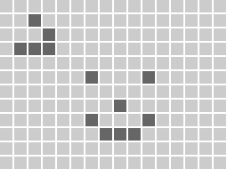

# music-sequencer
music-sequencer web component



```HTML

<script src="https://unpkg.com/@webcomponents/webcomponentsjs@2.0.0/webcomponents-bundle.js"></script>
<script type="module" src="https://unpkg.com/music-sequencer/index.js"></script>
<music-sequencer id="sequencer-1" rows="12" cols="16" size="16"/>


```

```JavaScript


const sequencer1 = document.getElementById("sequencer-1");

sequencer1.addEventListener('change', function (e) {
  console.log('music-sequencer change event', e)
  console.log('music-sequencer change event matrix', e.detail)
}, false);


```

Local module install:

```HTML

<script type="module" src="node_modules/music-sequencer/index.js"></script>


```
